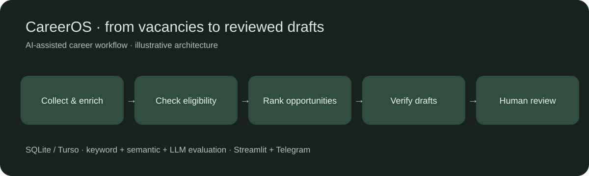
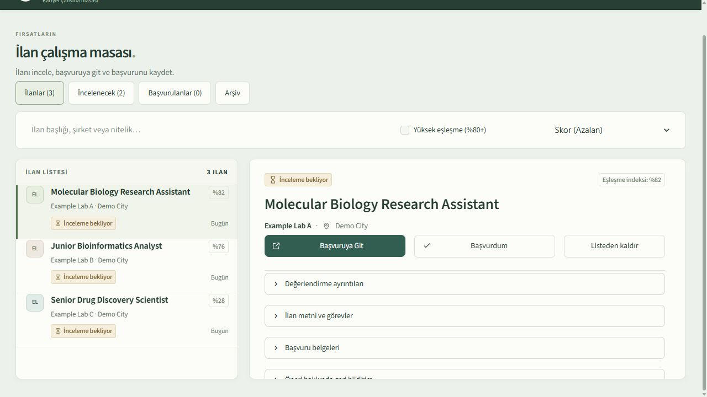

# CareerOS

[English](README.md) | [Türkçe](README.tr.md)

CareerOS, moleküler biyoloji, biyoinformatik ve hesaplamalı ilaç tasarımı alanlarında iş arayan bir adayın ilanları değerlendirmesine yardımcı olur. İlan toplar, uygunluk koşullarını kontrol eder, fırsatları sıralar ve kişinin incelemesi için başvuru taslakları hazırlar.

Bu kopyada kurgu aday verileri ve çevrimdışı bir demo bulunur. Yeni Git geçmişine gerçek veritabanı, aday belgeleri, erişim anahtarları ve işletim kayıtları dahil edilmemiştir. Arayüz ağırlıklı olarak Türkçedir.





Ekran görüntüsünde yalnız kurgu veriler bulunur. Gösterilen puanlar temsilidir.

## Özellikler

- Anahtar kelime eşleştirmesini, cümle gömmelerini ve yapılandırılmış LLM değerlendirmesini birleştirir.
- Deneyim, eğitim ve dil koşullarını kontrol eder; belirsiz kanıtları izler.
- Yerelde SQLite, isteğe bağlı olarak Turso/LibSQL kullanır.
- İnceleme ve başvuru durumlarını olay kaydıyla takip eder.
- Streamlit paneli ve isteğe bağlı Telegram bildirimleri sunar.
- CV ve ön yazı taslaklarını incelemeye sunmadan önce doğrulama kontrollerinden geçirir.

Yüksek eşleşme puanı, adayın bütün koşulları karşıladığını, mülakata çağrılacağını veya başvurunun gönderildiğini garanti etmez. Başvuru kararını kullanıcı verir.

## Erişim anahtarı olmadan dene

Python 3.12 veya üzerini kullan. Bu komut yalnız standart kütüphaneyi kullanır; ağa bağlanmaz ve veritabanı oluşturmaz:

```sh
python scripts/demo.py
```

Üç kurgu ilan [examples/jobs.json](examples/jobs.json) dosyasındadır. Puanlar demoyu göstermek için elle verilmiştir; model çıktısı değildir.

Paneli yerelde açmak için:

```sh
python -m venv .venv
# Windows: .venv\Scripts\activate
# macOS/Linux: source .venv/bin/activate
python -m pip install -r requirements-demo.txt
python scripts/demo.py --seed
```

PowerShell'de parola belirleyip paneli başlat:

```powershell
$env:DASHBOARD_PASSWORD = 'choose-your-local-password'
python -m streamlit run src/dashboard.py --server.address 127.0.0.1
```

macOS/Linux kabuklarında:

```sh
export DASHBOARD_PASSWORD='choose-your-local-password'
python -m streamlit run src/dashboard.py --server.address 127.0.0.1
```

`http://localhost:8501` adresini aç. Demo için Turso erişim bilgisi tanımlama. Veri ekleme komutu mevcut veritabanının üzerine yazmaz. Çevrimdışı örnek ve yerel panel, canlı ilan toplama akışını çalıştırmaz.

## Tam akışın kurulumu

```sh
python -m pip install -r requirements.txt
# Windows: Copy-Item .env.example .env
# macOS/Linux: cp .env.example .env
```

Kullanacağın servisleri `.env` dosyasında yapılandır. `data/master_cv.json` ve `data/master_cv.md` içindeki kurgu profili kendi bilgilerinle değiştir; belge şablonlarını kullanmadan önce gözden geçir. Tarayıcıyla ilan toplama veya PDF üretimi için `python -m playwright install chromium` gerekir. Cümle gömme modelleri ilk kullanımda indirilir. Canlı arama, ilan zenginleştirme ve LLM servisleri ücret oluşturabilir.

Yapılandırmayı tamamlayıp inceledikten sonra `python run_daily.py` komutunu çalıştır. Telegram isteğe bağlıdır; `python -m src.telegram_bot` operatör arayüzünü başlatır. Bu kopyada özel sunucu adresleri veya gerçek aday veritabanı bulunmaz.

## Mimari

`ilan toplama → zenginleştirme → uygunluk kontrolü → anahtar kelime/anlamsal eşleştirme → LLM değerlendirmesi → sıralama → belge doğrulama → insan incelemesi`

Veritabanı esas kaynaktır; başvuru durumları `src/db.py` üzerinden değiştirilir. Kaynak kod `src/`, çevrimdışı regresyon testleri `tests/`, kurgu veriler `data/` ve `examples/` klasörlerindedir.

## Sınırlar ve değerlendirme

Eksik açıklamalar, kapanmış ilanlar, dil koşulları ve deneyim ifadeleri eşleşmeyi etkiler. Sentetik regresyon sonuçları gerçek ilanlardaki öneri doğruluğunu ölçmez. Özel üretim karşılaştırmaları ve insan değerlendirme kayıtları bu kopyaya dahil edilmemiştir. Bazı belge şablonlarında alana özgü örnek eğitim ve araştırma ifadeleri bulunur; başka bir aday için kullanılmadan önce incelenmelidir.

Bu kopyada çalıştırılan kontroller [doğrulama kaydında](docs/VALIDATION.tr.md) yer alır. Özel kurulumun eski sonuçları bu kopyanın güncel doğrulaması olarak sunulmaz.

## Geliştirme

```sh
python -m pip install -r requirements-dev.txt
python -m pytest tests -q
python -m ruff check src tests scripts/demo.py
python -m mypy src/final_ranking.py
```

Testler canlı ağ erişimini engeller. Kişisel test verileri değiştirildiği için bu kopyanın sonuçları özel kurulumdan ayrı değerlendirilmelidir.

## Geliştirme süreci ve kullanım hakları

Uğur Cem Yıldız, CareerOS'u yapay zekâ desteğiyle geliştirdi; akışın gereksinimlerini ve kabul kararlarını belirledi. Yapay zekâ araçları uygulama ve doğrulama çalışmalarında kullanıldı.

Kaynak kod [LICENSE](LICENSE) koşullarıyla incelemeye açıktır. Yeniden kullanım ve dağıtım için izin gerekir. Bağımlılıkların kendi lisansları geçerlidir. Erişim anahtarları ve aday verileri Git'e eklenmemelidir; ayrıntılar [SECURITY.md](SECURITY.md) dosyasındadır.
